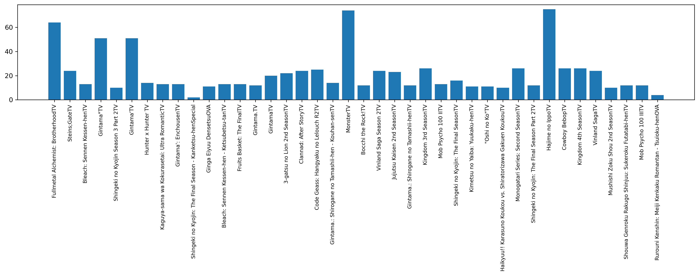
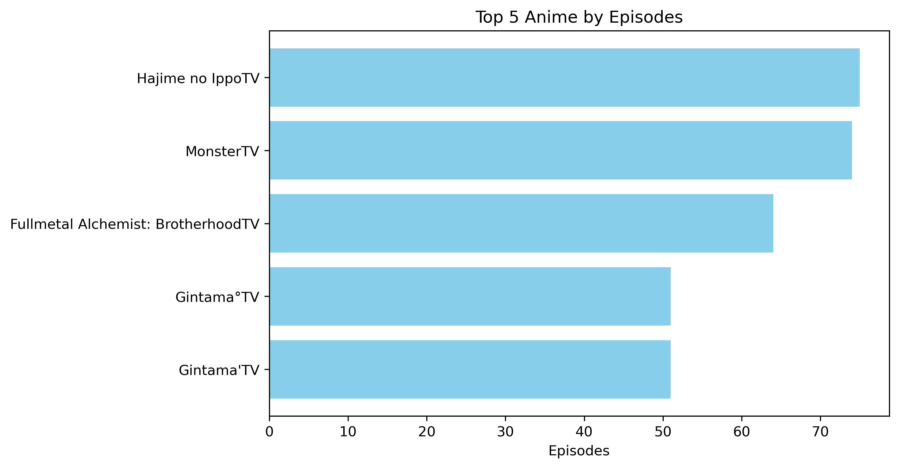
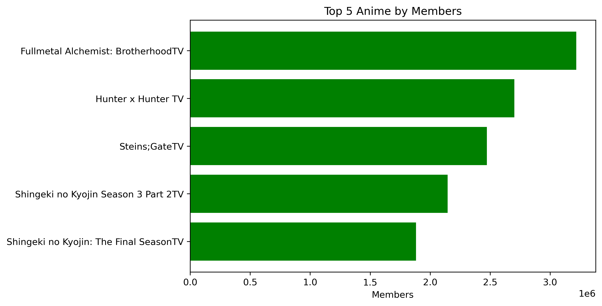

# Anime Data Cleaning and Analysis

This project processes and analyzes an anime dataset using Python and pandas in a Jupyter notebook. The workflow includes data cleaning, feature extraction, and visualization to gain insights into anime series based on their episodes, duration, and popularity.

## Steps Performed

1. **Import Libraries**
   - Uses `numpy`, `pandas`, `matplotlib.pyplot`, and `datetime` for data manipulation and visualization.

2. **Load Data**
   - Reads the dataset from `anime.csv` into a pandas DataFrame.

3. **Initial Exploration**
   - Displays the first few rows of the dataset to understand its structure.

4. **Feature Extraction**
   - Extracts the number of episodes and telecast duration from the `Title` column using string parsing.
   - Adds new columns: `Episode`, `Duration`, `Start`, and `End`.

5. **Data Type Conversion**
   - Converts the `Episode` column to integer type for analysis.

6. **Duration Parsing**
   - Splits the `Duration` column into `Start` and `End` months/years.
   - Calculates the total duration in months for each anime and stores it in `Duration_Months`.

7. **Data Cleaning**
   - Removes entries with zero duration.

8. **Extract Members Count**
   - Parses the number of members from the `Title` column and adds it as a new column `Members`.

9. **Title Cleaning**
   - Cleans the `Title` column to remove extra information, keeping only the anime name.

10. **Drop Unnecessary Columns**
    - Removes the `Start` and `End` columns after extracting relevant information.

11. **Save Cleaned Data**
    - Exports the cleaned DataFrame to `cleaned_anime.csv`.

12. **Visualization**
    - Plots bar charts and line graphs to visualize:
      - Number of episodes per anime
      - Duration in months
      - Top 5 anime by episodes, duration, and members

13. **Top 5 Analysis**
    - Identifies and visualizes the top 5 anime by episodes, duration, and members.

## How to Run

1. Place `anime.csv` in the same directory as the notebook.
2. Open the notebook in Jupyter or VS Code.
3. Run all cells sequentially.
4. The cleaned data will be saved as `cleaned_anime.csv` and several plots will be generated and saved as PNG files.

## Requirements
- Python 3.x
- pandas
- numpy
- matplotlib

Install requirements with:

```
pip install pandas numpy matplotlib
```


## Output Files
- `cleaned_anime.csv`: Cleaned dataset
- `my_graph1.png`, `my_graph2.png`, `my_graph3.png`, `my_graph4.png`: Visualizations

## Example Visualizations

Below are sample images generated by the notebook:

### Episodes per Anime


### Top 5 Anime by Episodes


### Top 5 Anime by Duration


### Top 5 Anime by Members


## Notes
- The notebook expects the `Title` column in `anime.csv` to contain episode, duration, and member information in a specific format.
- Adjust parsing logic if your dataset format differs.

